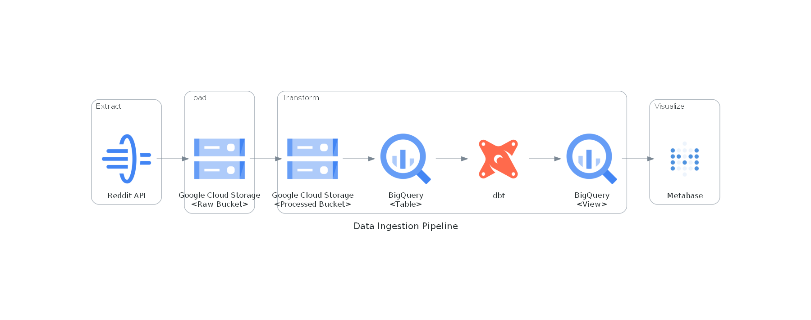
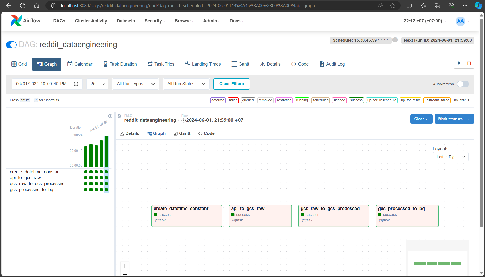
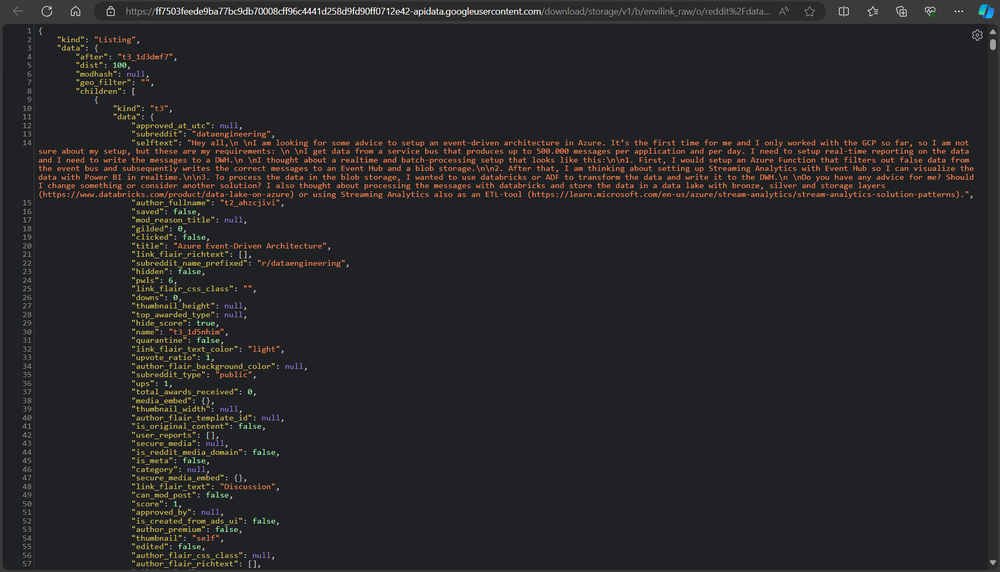
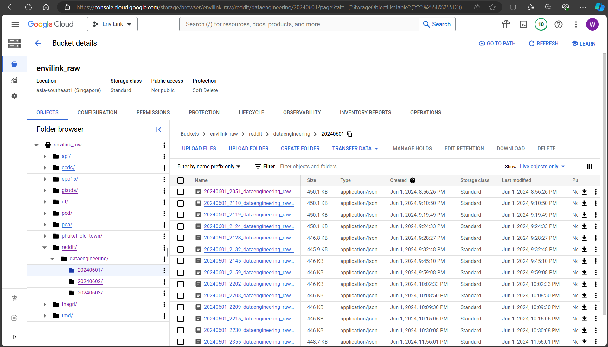
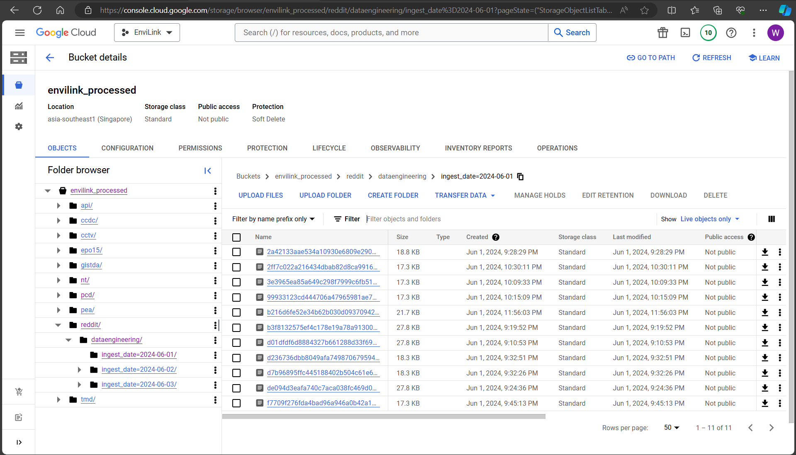
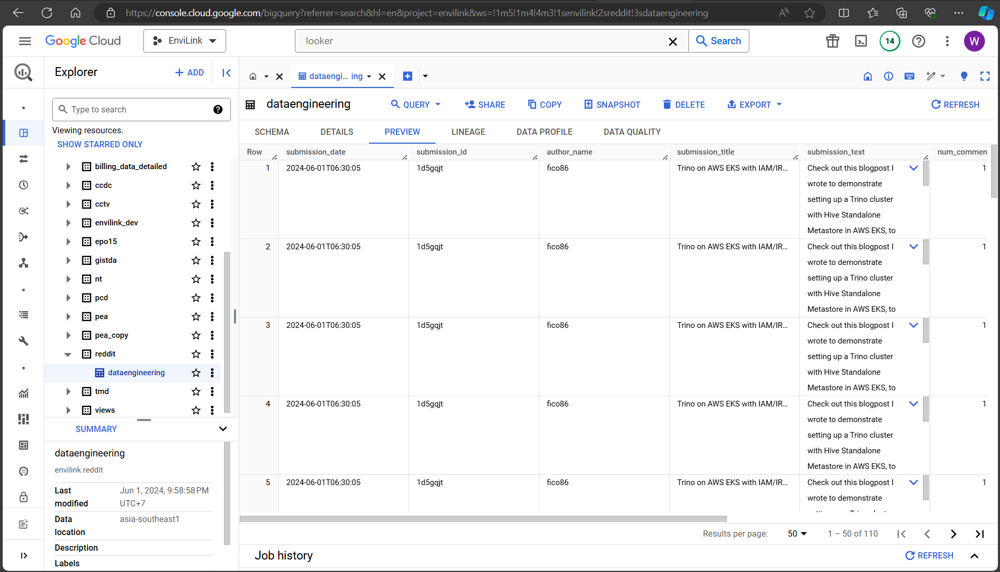
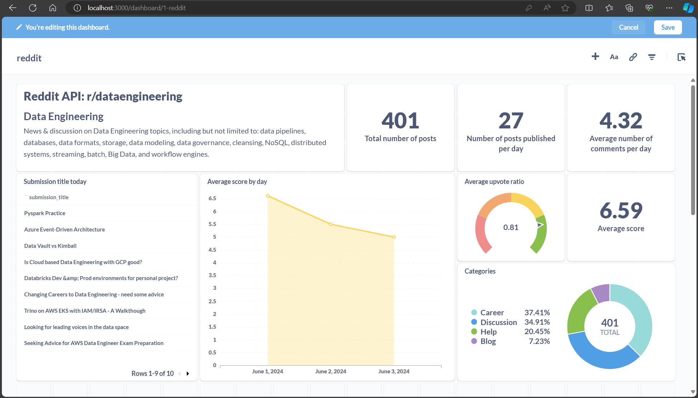

# BD656: Reddit API Data Pipeline Project

```yaml
Author: Witchakorn Wanasanwongkot
Student ID: 65130459
```

## Data Ingestion Pipeline




## Data Pipeline Orchestration

### Airflow



## Raw Data

**Source**: API reddit r/dataengineer



## Transformed Data

### Google Cloud Storage (raw bucket): JSON format


### Google Cloud Storage (processed bucket): PARQUET format


### BigQuery: Table/View


## Visualization

### Metabase



## Setting Up

Clone the repository to local
```bash
git clone https://github.com/NutBodyslam053/BD656-data_engineering.git
cd BD656-data_engineering
```

```bash
docker compose up --build -d
```

Access to Airflow
```bash
localhost:8080
```

- Add variables to Airflow environment
- Add connection to GCP

Access to Metabase
```bash
localhost:3000
```

- Add connection to BigQuery